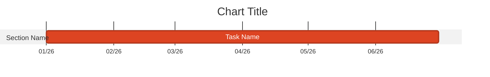

# Data Science Content Creation

## Weeknotes

### Structure

Four sections (H2 headers only):
- `## Successes`
- `## Failures`
- `## Blockers`
- `## In-Flight`

### Two-Stage Workflow

**Stage 1 — Research** (`~/WEEKNOTE.md` + scratch notes):

Launch three background agents **in parallel**, each writing raw findings to disk immediately:

- **Agent 1 — Atlassian**: JIRA + Confluence activity → `~/scratch/weeknote-atlassian-YYYY-MM-DD.md`
- **Agent 2 — Git**: all repos in `~/src/` → `~/scratch/weeknote-git-YYYY-MM-DD.md`
- **Agent 3 — Work IQ**: meetings, Teams discussions, DS Office Hour specifics, emails → `~/scratch/weeknote-workiq-YYYY-MM-DD.md`

**Critical**: agents must write findings verbatim to their scratch files. Do NOT rely on context alone — context gets compressed and data is lost. The scratch files are the source of truth.

Work IQ agent should run four queries, saving each result as it arrives:
1. Meetings (with times in BST/GMT+1, organisers, attendees, transcript highlights)
2. Teams discussions (specific topics, decisions, who said what — grouped by topic)
3. DS Office Hour specifically (check chat, shared files, transcript)
4. Emails (sender/recipient, subject, key content, outcomes)

Once agents complete, integrate all three scratch files into `~/WEEKNOTE.md` (day-by-day, comprehensive, not for publishing). Preserve the scratch files — they survive context compression.

**Stage 2 — Day-by-day verification** (with user):
Walk through each day with the user to confirm, correct, and fill gaps before publishing. Reference scratch files to answer questions — do not rely on memory.

**Stage 3 — Editorial** (publish-ready):
- Filter signal from noise (omit routine 1:1s, admin tasks)
- Consolidate related items thematically
- Apply voice guidelines (see voice-style skill in bolster plugin)
- **Do NOT create Confluence page until user explicitly approves**

### Date Calculation

Find the Monday of the current week (macOS):
```bash
date -j -v-$(($(date +%u) - 1))d +%Y-%m-%d
```

Title format: `YYYY-MM-DD` (Monday's date).

### Formatting Requirements

- **Only H2 section headers** — no H1, no H3
- **Bold bullets for topics**: `* **Topic Name**`
- **No horizontal rules** as section separators
- **No date in body** — title contains the date
- **No H1 in body** — Confluence renders the page title as H1 automatically

### Successes Priority Order

1. Production incidents and resolutions (always include with full context)
2. Major project milestones
3. External engagement (publications, presentations, partnerships)
4. LLM Gateway metrics — ONLY if data is available; never fabricate
5. Team contributions (Tim:, Conor: prefixes)
6. Infrastructure/technical work with meaningful impact
7. Meetings with specific documentable outcomes

### LLM Gateway Metrics (Successes)

Primary source (requires network):
```bash
uv run scripts/manage.py usage-summary --lookback 7 --markdown
```

Alternative via Service-MCP (see data-analytics skill for queries).

If unavailable: link to dashboard — never fabricate numbers.

### Failures

Genuine setbacks, named specifically. Apply dry humor. At least one specific, authentic failure per weeknote — no generic placeholders.

### Blockers

- Each blocker should link to a JIRA ticket (prompt to create one if missing)
- Format: `DS-###` for ticket references
- Name the specific system/access being blocked

### In-Flight

- Flat bullet list, no subsections
- Include specific dates for upcoming commitments
- Name collaborators
- 1-2 week forward-looking window

### Publication

Publish to Confluence:
- **Space**: Personal `~bolster` (ID: `11042819`)
- **Parent folder**: Weeknotes (ID: `841482874`)

## Monthly Blog Posts

Structure: **TL;DR**, **Things we loved reading this month**, **What was accomplished this month?**, **What got in the way?**, **What's next?**, **Alternative Memes**

YAML frontmatter:
```yaml
---
title: "Month YYYY Update: [Hook]"
date: YYYY-MM-DD
author: Andrew Bolster
type: monthly-blog
---
```

### Reading Section Format
```
* [Article Title](URL) - Brief description of relevance
```

### Accomplishments Section Format
```
* **Major Category**
  * Specific achievement with metrics
  * Attribution: "Thanks to @Person for specific contribution"
```

Note: Published version uses `+` for sub-bullets, not `*`.

## Work IQ Queries for Research

Run via background agent — save all responses verbatim to `~/scratch/weeknote-workiq-YYYY-MM-DD.md` as they arrive.

Standard queries (run all four):
- "What meetings did I attend during the week of [Mon]–[Fri] YYYY? For each: title, date, time in BST, duration, organiser, attendees, transcript highlights."
- "What were the key discussion topics in my Teams chats and channels during [week]? Specific details: who said what, decisions made, problems raised. Group by topic."
- "What was discussed in the Data Science Office Hour on [date]? Check meeting chat, shared files, transcript."
- "What emails did I send or receive during [week]? Sender/recipient, subject, key content, outcomes. Group by topic."

Use returned `conversationId` for follow-up questions on any query. WorkIQ groups by topic — integrate thoughtfully into day-by-day sections. If a query returns no transcript, try asking for meeting chat or follow-up emails instead.

## Mermaid Gantt Charts (if needed)

Reliable pattern:


Pitfalls: mixed date formats break rendering; `milestone` tags often fail; don't indent tasks.
