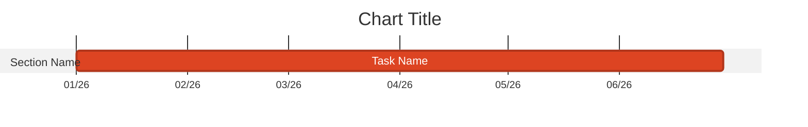

# Data Science Content Creation

## Weeknotes

### Orientation — Check Before You Start

**Do not rely solely on the date command.** First check the most recently published weeknote in Confluence to confirm which week has already been written up:

```
Search Confluence: parent = <weeknotes-folder-id> ORDER BY lastmodified DESC LIMIT 1
```

The week to write is the one *after* the most recent published weeknote. Only then calculate the Monday date:

```bash
date -j -v-$(($(date +%u) - 1))d +%Y-%m-%d   # macOS only
```

Title format: `YYYY-MM-DD` (Monday's date). Clear `~/WEEKNOTE.md` before starting a new week's research.

### Structure

Four sections (H2 headers only):
- `## Successes`
- `## Failures`
- `## Blockers`
- `## In-Flight`

### Research Workflow

**Stage 1 — Parallel research** (`~/WEEKNOTE.md` as scratch):

Launch agents **in parallel**, each writing raw findings to disk immediately:

- **Agent 1 — Atlassian**: JIRA + Confluence activity → `~/scratch/weeknote-atlassian-YYYY-MM-DD.md`
- **Agent 2 — Git/GitHub**: commits, PRs, issues across team orgs → `~/scratch/weeknote-git-YYYY-MM-DD.md`
- **Agent 3 — Work IQ**: meetings, Teams discussions, DS Office Hour specifics, emails → `~/scratch/weeknote-workiq-YYYY-MM-DD.md`

**Critical**: agents must write findings verbatim to their scratch files. Do NOT rely on context alone — context gets compressed and data is lost. The scratch files are the source of truth.

Work IQ agent should run four queries, saving each result as it arrives:
1. Meetings (with times in BST/GMT+1, organisers, attendees, transcript highlights)
2. Teams discussions (specific topics, decisions, who said what — grouped by topic)
3. DS Office Hour specifically (check chat, shared files, transcript)
4. Emails (sender/recipient, subject, key content, outcomes)

Once agents complete, integrate all three scratch files into `~/WEEKNOTE.md` (day-by-day, comprehensive, not for publishing). Preserve the scratch files — they survive context compression.

**Stage 2 — Day-by-day verification** (with user):
Ask the user whether they want to walk through each day to confirm, correct, and fill gaps before drafting. This is best practice — particularly useful when the week spans bank holidays, travel, or external events. Reference scratch files to answer questions — do not rely on memory.

**Stage 3 — Editorial** (publish-ready):
- Filter signal from noise (omit routine 1:1s, admin tasks without outcomes)
- Consolidate related items thematically
- Avoid timing qualifiers like "same-day" on individual items — let the content speak for itself
- **Do NOT create Confluence page until user explicitly approves the draft**

### Git/GitHub Research

**Resolve the user's GitHub identity first** — do not assume a username:

```bash
gh api user --jq '{login: .login, name: .name}'
```

Use the returned `login` for commit author filtering. Then for each team repo:

1. **Commits** — search without `--author` filter first (catches all authors on the branch), then verify authorship:
   ```bash
   git -C <repo> fetch --quiet
   git -C <repo> log --oneline --all --since=YYYY-MM-DD --until=YYYY-MM-DD
   ```

2. **PRs opened, reviewed, or merged** — use `gh pr list` not just git log:
   ```bash
   gh pr list --repo <org>/<repo> --state all \
     --json number,title,state,url,updatedAt,mergedAt,author \
     | jq '.[] | select(.updatedAt >= "YYYY-MM-DD")'
   ```

3. **Issues created or transitioned** — check separately:
   ```bash
   gh issue list --repo <org>/<repo> --state all \
     --json number,title,state,url,updatedAt \
     | jq '.[] | select(.updatedAt >= "YYYY-MM-DD")'
   ```

Which orgs to check is personal config (see user's local config). Do not check personal repos unless the user explicitly asks.

### JIRA Research

Search for DS project issues created or updated during the week:

```
project = DS AND updated >= "YYYY-MM-DD" AND updated <= "YYYY-MM-DD" ORDER BY updated DESC
```

Also check for cross-project activity:
```
assignee = currentUser() AND updated >= "YYYY-MM-DD" AND project != DS ORDER BY updated DESC
```

### Jira Issue References

Always hyperlink ticket references — never bare `DS-###`:
```
[DS-###](https://blackduck.atlassian.net/browse/DS-###)
```

When closing a ticket as resolved by another artifact (e.g. a Confluence page), add a comment with the resolving link *before* transitioning to Done.

### Formatting Requirements

- **Only H2 section headers** — no H1, no H3
- **Bold bullets for topics**: `* **Topic Name**`
- **No horizontal rules** as section separators
- **No date in body** — title contains the date
- **No H1 in body** — Confluence renders the page title as H1 automatically
- **No "same-day" or similar timing qualifiers** on individual items

### Successes Priority Order

1. Production incidents and resolutions (always include with full context)
2. Major project milestones
3. External engagement (publications, presentations, partnerships)
4. LLM Gateway metrics — ONLY if data is available; never fabricate
5. Team contributions (Tim:, Conor: prefixes)
6. Infrastructure/technical work with meaningful impact
7. Meetings with specific documentable outcomes

### LLM Gateway Metrics (Successes)

Primary source (requires network to llm.labs.blackduck.com):
```bash
uv run ~/src/service-llm/scripts/manage.py usage-summary --lookback 7 --markdown
```

Alternative via Service-MCP — standard queries (substitute week's Monday date):

**Top-line summary:**
```sql
SELECT COUNT(*) AS total_requests, COUNT(DISTINCT user_id) AS unique_users,
  SUM(total_tokens) AS total_tokens, ROUND(SUM(response_cost),2) AS cost_usd,
  SUM(CASE WHEN call_type='acompletion' THEN 1 END) AS chat_requests,
  SUM(CASE WHEN call_type='aembedding' THEN 1 END) AS embedding_requests
FROM data_product_staging.llm_gateway.stg_llm_gateway__llm_gateway_usage
WHERE created_at >= 'YYYY-MM-DD' AND created_at < 'YYYY-MM-DD'
```

**By model:**
```sql
SELECT CAST(model_group AS STRING) AS model, COUNT(*) AS requests,
  ROUND(SUM(response_cost),2) AS cost_usd
FROM data_product_staging.llm_gateway.stg_llm_gateway__llm_gateway_usage
WHERE created_at >= 'YYYY-MM-DD' AND created_at < 'YYYY-MM-DD'
GROUP BY CAST(model_group AS STRING) ORDER BY requests DESC LIMIT 10
```

**By team (chat only):**
```sql
SELECT CAST(team_alias AS STRING) AS team, COUNT(*) AS requests,
  ROUND(SUM(response_cost),2) AS cost_usd
FROM data_product_staging.llm_gateway.stg_llm_gateway__llm_gateway_usage
WHERE created_at >= 'YYYY-MM-DD' AND created_at < 'YYYY-MM-DD'
  AND call_type='acompletion'
GROUP BY CAST(team_alias AS STRING) ORDER BY cost_usd DESC LIMIT 10
```

If querying mid-week, flag that totals are incomplete vs a prior full week.

If all sources unavailable: link to the [LLM Analytics Dashboard](https://adb-1509998832420984.4.azuredatabricks.net/dashboardsv3/01f0cab69ad71cf1a545e34b74ee6583/published?o=1509998832420984) — never fabricate numbers.

### Failures

Genuine setbacks, named specifically. Apply dry humor. At least one specific, authentic failure per weeknote — no generic placeholders. If something initially felt like a failure but on reflection was handled appropriately, remove it.

### Blockers

- Each blocker should link to a JIRA ticket — prompt to create one if missing
- Always hyperlink: `[DS-###](https://blackduck.atlassian.net/browse/DS-###)`
- Name the specific system or access being blocked (not just "billing access" — "GCP Billing Console access")

### In-Flight

- Flat bullet list, no subsections
- Include specific dates for upcoming commitments
- Name collaborators
- 1-2 week forward-looking window

### Publication

Publish to Confluence under the user's personal weeknotes folder. The DS space ID is `150863953` (key: `DS`). The user's personal space ID and weeknotes parent folder ID are personal config — ask the user if not already known:

- **Space ID**: user's personal space (e.g. `11042819` for `~bolster`)
- **Parent folder ID**: weeknotes folder within that space (e.g. `841482874`)
- **Title**: `YYYY-MM-DD` (Monday's date)
- **Content format**: `markdown`

Do not include an H1 title or author line in the page body — Confluence renders the page title and author automatically.

## Monthly Blog Posts

Structure: **TL;DR**, **Things we loved reading this month**, **What was accomplished this month?**, **What got in the way?**, **What's next?**, **Alternative Memes**

YAML frontmatter (for local drafting only — strip before publishing to Confluence):
```yaml
---
title: "Month YYYY Update: [Hook]"
date: YYYY-MM-DD
type: monthly-blog
---
```

### Reading Section Format
```
* [Article Title](URL) - Brief description of relevance
```

### Accomplishments Section Format
```
* **Major Category**
  * Specific achievement with metrics
  * Attribution: "Thanks to @Person for specific contribution"
```

Note: Published version uses `+` for sub-bullets, not `*`.

## Work IQ Queries for Research

Run via background agent — save all responses verbatim to `~/scratch/weeknote-workiq-YYYY-MM-DD.md` as they arrive.

Standard queries (run all four):
- "What meetings did I attend during the week of [Mon]–[Fri] YYYY? For each: title, date, time in BST, duration, organiser, attendees, transcript highlights."
- "What were the key discussion topics in my Teams chats and channels during [week]? Specific details: who said what, decisions made, problems raised. Group by topic."
- "What was discussed in the Data Science Office Hour on [date]? Check meeting chat, shared files, transcript."
- "What emails did I send or receive during [week]? Sender/recipient, subject, key content, outcomes. Group by topic."

Use returned `conversationId` for follow-up questions on any query. WorkIQ groups by topic — integrate thoughtfully into day-by-day sections. If a query returns no transcript, try asking for meeting chat or follow-up emails instead.

## Mermaid Gantt Charts (if needed)

Reliable pattern:


Pitfalls: mixed date formats break rendering; `milestone` tags often fail; don't indent tasks.
